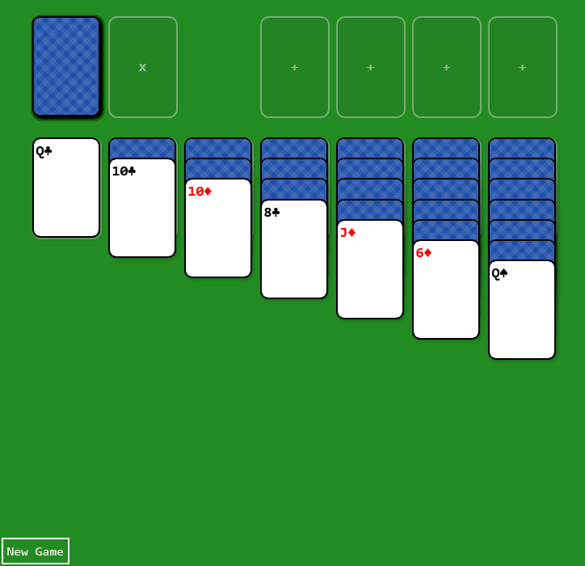

# Card Game Template

A lightweight, zero-dependency template for building card games with plain HTML elements. No canvas, no frameworks — just DOM nodes styled with CSS and wired together with vanilla JavaScript.

## Overview

The template provides two core building blocks exposed on a global `CT` object:

- **`CT.Card`** — A playing card backed by a `<div>`. Supports front/back faces, flip animations, highlights, background images, context menus, and customisable DOM via a `createDom` override.
- **`CT.Slot`** — A container that holds a set of cards. Slots handle layout (horizontal, vertical, or stacked) and auto-tidy cards when the pile changes.

Cards are moved between slots with `card.move(slot)` (or the lower-level `CT.cardMove()`), which updates both the data model and the DOM in one call.

## Files

| File | Description |
|---|---|
| `cards.js` | Core logic — `Card` class, `Slot` class, move helpers, menu system |
| `cards.css` | All card, slot, and animation styles driven by `--cardwidth` / `--cardheight` custom properties |
| `examples/solitaire.html` | A playable Klondike Solitaire built entirely on the template |

## Quick Start

1. Include `cards.css` and `cards.js` in your HTML page:

```html
<link rel="stylesheet" href="cards.css">
<script src="cards.js"></script>
```

2. Set card dimensions and apply them:

```javascript
CT.Card.cardWidth = 100;
CT.Card.cardHeight = 150;
CT.Card.setCSS();
```

3. Create slots by passing a DOM element that will act as the pile container:

```html
<div id="hand" class="deckempty cardplaceholder" style="--text-card: 'Hand'"></div>
```

```javascript
const hand = new CT.Slot({
    size: 5,                                  // max cards
    domPile: document.querySelector("#hand"),
    slotName: "hand",
    widthCard: 3,                             // layout width in card-widths
});
```

4. Create cards and move them into slots:

```javascript
const card = new CT.Card({ cardName: "Ace of Spades" });
card.createDom();
card.move(hand);
```

## Card API

| Method / Property | Description |
|---|---|
| `new CT.Card({ cardName, colorBg, imgBg, isOpen, createDom, style })` | Create a card instance |
| `card.createDom()` | Build (or rebuild) the card's DOM element |
| `card.move(slot)` | Move the card to a target slot |
| `card.faceFlip(isAnim?)` | Toggle between face-up and face-down |
| `card.faceOpen(isAnim?)` | Flip to face-up |
| `card.faceClose(isAnim?)` | Flip to face-down |
| `card.highlightOn()` | Add animated gold highlight |
| `card.highlightOff()` | Remove highlight |

## Slot API

| Method / Property | Description |
|---|---|
| `new CT.Slot({ size, domPile, slotName, widthCard, heightCard })` | Create a slot bound to a DOM element |
| `slot.pile` | `Set` of cards currently in the slot |
| `slot.tidy()` | Re-layout all cards in the slot |

## CSS Classes

| Class | Purpose |
|---|---|
| `.card` | Base card element |
| `.deck` | Filled slot (e.g. draw pile) |
| `.deckempty` | Empty slot placeholder |
| `.cardplaceholder` | Shows a label inside an empty slot via `--text-card` |
| `.deckselect` | Orange pulsing overlay for generic selection |
| `.deckallow` | Green pulsing overlay for valid drop targets |
| `.deckrestrict` | Red pulsing overlay for restricted drop targets |
| `.card-highlight` | Gold glow effect on a card |
| `.cardmenu` / `.cardmenuitem` | Context menu anchored to a card |

## Example — Klondike Solitaire

[**Play Solitaire**](https://hanaddi.github.io/Card-Game-Template/examples/solitaire.html)

[](https://example.com/solitaire)

A full Klondike Solitaire game built entirely on the template (`examples/solitaire.html`). Demonstrates card creation with custom DOM, slot nesting (cards containing child slots for tableau columns), drag-and-drop movement, face flipping, and win detection.

## License

[MIT](LICENSE)
